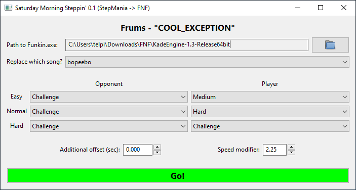

# Saturday Morning Steppin'
Saturday Morning Steppin' is a StepMania simfile injector for Friday Night Funkin'.

## Do NOT use this to distribute any content you don't have the rights for!
But it might make it easier for you to *create* new mods and share them!

## How to use!
1. **Close Friday Night Funkin' before you begin replacing data.**
1. Download the [release](https://github.com/telperion/saturday-morning/releases) and unzip to a directory of your choice.
1. Drag-and-drop a StepMania song folder onto SaturdayMorning.exe.
1. Select the location of Funkin.exe in your Friday Night Funkin' install.
1. Select the Friday Night Funkin' song to replace the files for.
   - Don't worry, the program will make a backup copy of your FNF install's
     song data the first time you run it (in a `_backup` folder).
1. Choose which charts are played by you and your opponent for each
   difficulty of the song.
1. Set your desired reading speed.
   - (2.0 is probably fine...y'all short reaction time havers)
1. Press **Go!** when you're ready.
1. If no errors pop up, you're done! You can continue to inject simfile data
   or restart Friday Night Funkin' from here and enjoy.

## Why have you done this?
We at the StepMania community didn't spend two decades writing charts with a
nice selection of editors just to have a burgeoning new rhythm game community
wade through click-to-place interfaces and BPM/sync woes.

### Recommended editors
- [ArrowVortex](https://arrowvortex.ddrnl.com/)
- [StepMania 5.3 "OutFox"](https://projectmoon.dance/)
- [StepMania 5.1](https://github.com/stepmania/stepmania/releases)
- [NotITG](https://notitg.heysora.net/)

## How to build!
1. Install Python 3.8.
2. Install [pipenv](https://github.com/pypa/pipenv): `pip install pipenv`
3. Set up the build environment: `pipenv install --dev`

## Shoutouts
- [shockdude](https://github.com/shockdude/fnf-to-sm) and
  [NyxTheShield](https://github.com/NyxTheShield/MIDI2FNF), who have also put
  some effort in this direction. (I had a bunch of chart-parsing code on hand
  already so I'll admit I didn't use the existing work)
- [ashastral](https://github.com/garcia/simfile) for their `simfile` library,
  which does a lot of the initial heavy lifting.
- [The Club Fantastic Team](https://clubfantastic.dance/) for the test
  materials.
- [TaroNuke](https://www.twitch.tv/taronuke) and
  [CHRS4LFE](https://www.twitch.tv/chrs4lfe), for being open-minded enough to
  stream a bit of FNF and cause an intersection of the two communities.
